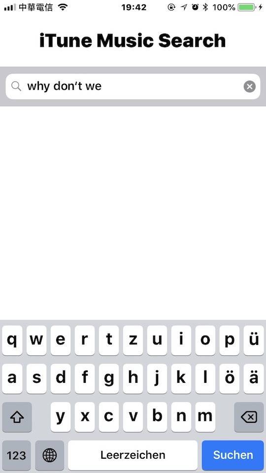
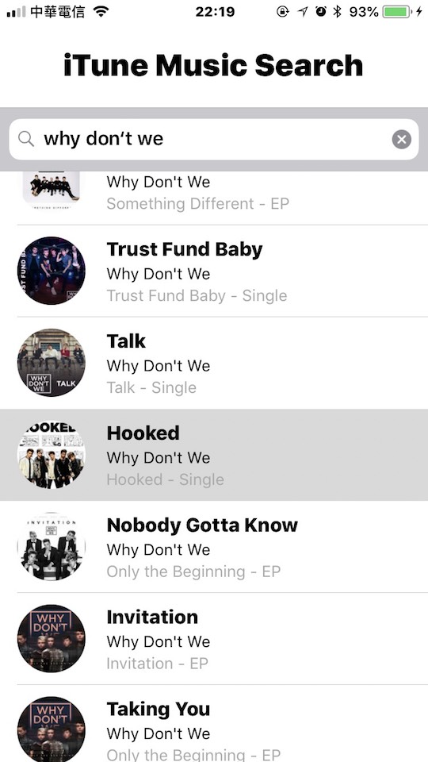
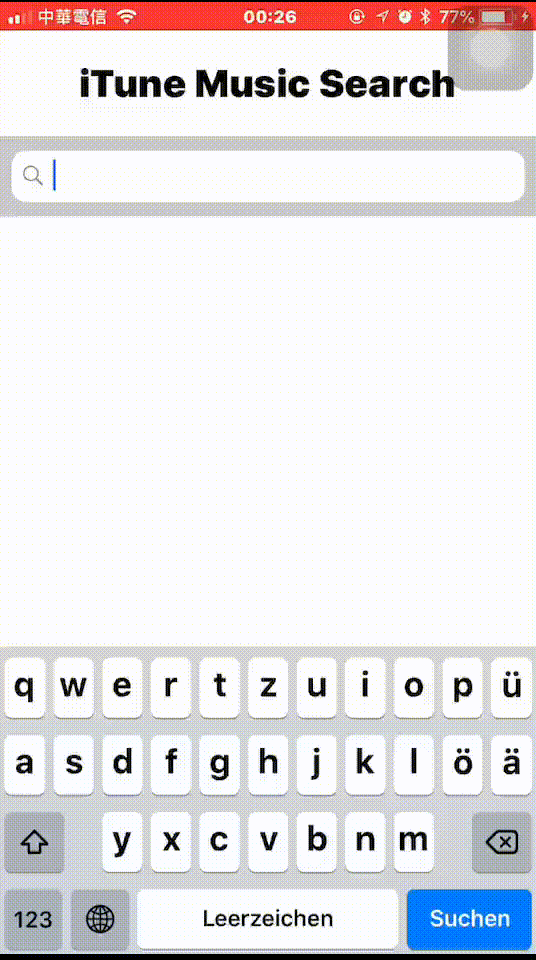

# App: iTune Music Search

A practice project to fetch iTune Music data.

|  |  |  |
|---|---|---|

[Demo Video](https://www.youtube.com/watch?v=g7d0KIZZJvo) (Youtube)
  

It is a simple App that used to search the music which is in iTunes Music. When you input some keyword, and the app will find the related tracks back and list results on tableView under the search bar. And if you tap the track on the list, it will play the preview track.

**API** 
[iTunes Search API](https://affiliate.itunes.apple.com/resources/documentation/itunes-store-web-service-search-api/)

**Reference** 
[利用 Swift 4 的 JSONDecoder 和 Codable 解析 JSON 和生成自訂型別資料](https://medium.com/%E5%BD%BC%E5%BE%97%E6%BD%98%E7%9A%84-swift-ios-app-%E9%96%8B%E7%99%BC%E5%95%8F%E9%A1%8C%E8%A7%A3%E7%AD%94%E9%9B%86/%E5%88%A9%E7%94%A8-swift-4-%E7%9A%84-jsondecoder-%E5%92%8C-codable-%E8%A7%A3%E6%9E%90-json-%E5%92%8C%E7%94%9F%E6%88%90%E8%87%AA%E8%A8%82%E5%9E%8B%E5%88%A5%E8%B3%87%E6%96%99-ee793622629e) 
[Swift - 搜索条（UISearchBar）的用法](http://www.hangge.com/blog/cache/detail_562.html) 
[Loading/Downloading image from URL on Swift](https://stackoverflow.com/questions/24231680/loading-downloading-image-from-url-on-swift) 
[How to play mp3 audio from URL in ios swift](https://stackoverflow.com/questions/34563329/how-to-play-mp3-audio-from-url-in-ios-swift)

